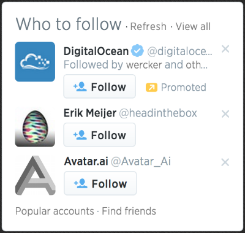
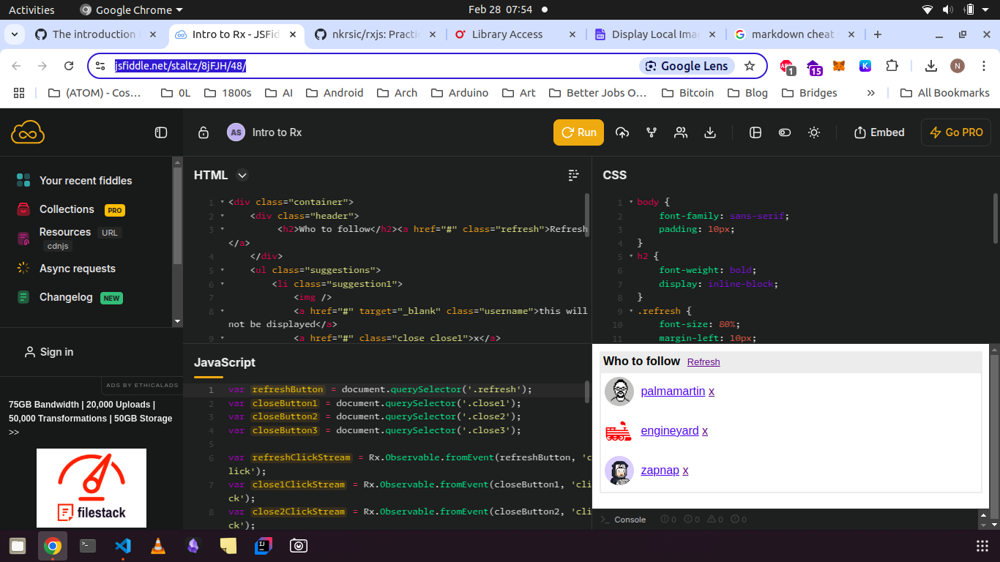

# follow-on-twitter

The desired end goal is similar to the photos below: 




(The example proceeds using the Github user API instead of Twitter)

## Startup - Everything is a stream 

The idiom "everything is a stream" is common in Reactive programming, as there is usually 
a way to coerce real world problems into a series of events. We start with our initial 
query to the Github user API and consider a stream with only one "event", the url we 
want to use: 

```
--- (https://api.github.com/users) -----------------------> 
```


